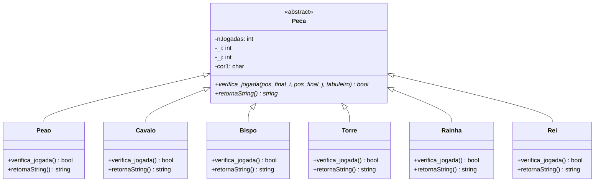

# C++ Chess Game (Version 3 - Polymorphism)

A terminal-based chess game written in **C++** that demonstrates object-oriented programming (OOP) principles, specifically **polymorphism** and inheritance. The game renders a visual chess board in the terminal using Unicode chess symbols and processes game moves through a custom algebraic move parser.

---

## Key Features

* **Polymorphic Architecture**: Chess pieces inherit from a common abstract base class (`Peca`), defining their movements dynamically.
* **Terminal Board Rendering**: Beautiful visual feedback using custom Unicode characters to represent the pieces on the board.
* **Special Chess Rules**:
  * **En Passant**: Supported with historical pawn-move verification.
  * **Castling (Roque)**: Implemented for both King-side (Roque Menor) and Queen-side (Roque Maior).
  * **Check Detection stubs**: Groundwork for check validation.
* **Dual Execution Modes**:
  * **Interactive Mode**: Input moves turn-by-turn directly in the CLI.
  * **File Replay Mode**: Parse and replay chess games from recorded input files (e.g., `entrada.dat`).
* **Cross-Platform Compilation**: Supports both **Windows** (Command Prompt, PowerShell, Git Bash) and **Linux/macOS** through a single Makefile.

---

## Repository Structure

The project has been organized into clean directories separating interface/header declarations from implementation code:

```
├── include/                   # Header files (.h / .hpp)
│   ├── peca.h                 # Abstract base class for chess pieces
│   ├── peao.h                 # Pawn class header
│   ├── cavalo.h               # Knight class header
│   ├── bispo.h                # Bishop class header
│   ├── torre.h                # Rook class header
│   ├── rainha.h               # Queen class header
│   ├── rei.h                  # King class header
│   ├── tabuleiro.h            # Chess board management
│   ├── impressaoTerminal.hpp  # Terminal printing utility
│   ├── dataFileReader.hpp     # File parser helper
│   ├── aborta.hpp             # Error handling helper
│   ├── meusTipos.hpp          # Type definitions helper
│   └── numeros.hpp            # Number helper functions
├── src/                       # Source implementation files (.cpp)
│   ├── main.cpp               # Game controller and main loop
│   ├── peao.cpp               # Pawn movement logic
│   ├── cavalo.cpp             # Knight movement logic
│   ├── bispo.cpp              # Bishop movement logic
│   ├── torre.cpp              # Rook movement logic
│   ├── rainha.cpp             # Queen movement logic
│   ├── rei.cpp                # King movement logic
│   └── tabuleiro.cpp          # Board setup, moves, Roque, and En Passant logic
├── entrada.dat                # Sample move file
├── Makefile                   # Cross-platform Makefile
├── LICENSE                    # GPL-3.0 License details
└── README.md                  # This file
```

---

## Build & Compilation

To build and compile the application, you will need a C++ compiler (`g++` supporting C++11 or newer) and `make` installed on your machine.

### Windows (CMD, PowerShell, or Git Bash)
Open your terminal in the project directory and run:
```bash
make
```
This generates the `Chess.exe` executable.

### Linux / macOS
Open your terminal and run:
```bash
make
```
This generates the `Chess` executable.

### General Makefile Commands
* **Build Project**: `make` or `make all`
* **Clean Object Files**: `make clean`
* **Run Executable**: `make run`
* **Memory Check (Linux/macOS)**: `make valgrind` (runs Valgrind memory diagnostic tool)

---

## How to Run & Play

The application supports two play modes. You can configure which mode to use by modifying the `tipo_leitura` variable inside [src/main.cpp](file:///c:/Users/lucas/Documents/LUCAS/Chess-Game-Version-3-Polymorphism/src/main.cpp#L26).

### 1. Interactive Mode (Default)
In [src/main.cpp](file:///c:/Users/lucas/Documents/LUCAS/Chess-Game-Version-3-Polymorphism/src/main.cpp#L26), verify the variable is set to:
```cpp
bool tipo_leitura = via_terminal;
```

**To compile and run**:
```bash
make clean
make
make run
```
Once launched, the board prints to the console, and players take turns entering moves when prompted:
```text
   a  b  c  d  e  f  g  h  
 ---------------------------
 1| ♜  ♞  ♝  ♚  ♛  ♝  ♞  ♜ |1
 2| ♟  ♟  ♟  ♟  ♟  ♟  ♟  ♟ |2
 3| -  -  -  -  -  -  -  - |3
 4| -  -  -  -  -  -  -  - |4
 5| -  -  -  -  -  -  -  - |5
 6| -  -  -  -  -  -  -  - |6
 7| ♙  ♙  ♙  ♙  ♙  ♙  ♙  ♙ |7
 8| ♖  ♘  ♗  ♔  ♕  ♗  ♘  ♖ |8
 ---------------------------
   a  b  c  d  e  f  g  h  

Entrada Time Branco: e4
```
* Type `fim` at any time to exit the game.

### 2. File Replay Mode
To replay a match recorded in a `.dat` file (such as `entrada.dat`):
1. In [src/main.cpp](file:///c:/Users/lucas/Documents/LUCAS/Chess-Game-Version-3-Polymorphism/src/main.cpp#L26), set the variable to:
   ```cpp
   bool tipo_leitura = jogo_via_arquivo;
   ```
2. Recompile the project:
   ```bash
   make clean
   make
   ```
3. Run the executable, passing the path to the move file as an argument:
   ```bash
   # Windows
   .\Chess.exe entrada.dat

   # Linux/macOS
   ./Chess entrada.dat
   ```

---

## Chess Move Notation Guide

The game expects moves in **Portuguese algebraic notation**. Since the internal parser decodes Portuguese abbreviations, make sure to use the letters specified in the table below:

| Piece (Portuguese) | Symbol | English Equivalent | Notation Prefix | Example Move |
| :--- | :---: | :---: | :---: | :--- |
| **Peão** (Pawn) | ♙ / ♟ | Pawn | *None (lowercase col)* | `e4` (Pawn to e4) |
| **Cavalo** (Knight) | ♘ / ♞ | Knight | **C** | `Cf3` (Knight to f3) |
| **Bispo** (Bishop) | ♗ / ♝ | Bishop | **B** | `Bc4` (Bishop to c4) |
| **Torre** (Rook) | ♖ / ♜ | Rook | **T** | `Td1` (Rook to d1) |
| **Dama / Rainha** (Queen) | ♕ / ♛ | Queen | **D** | `Dh5` (Queen to h5) |
| **Rei** (King) | ♔ / ♚ | King | **R** | `Re2` (King to e2) |

### Notation Examples
* **Basic movement**:
  * `e4`: Move pawn to `e4` square.
  * `Cf3`: Move knight to `f3`.
  * `Bc4`: Move bishop to `c4`.
* **Captures**:
  * `exd4`: Pawn on column `e` captures opponent piece on `d4`.
  * `Cxf3`: Knight captures opponent piece on `f3`.
* **Castling (Roque)**:
  * King side (Roque Menor): Move the King to the target square (e.g. `g1` / `g8` / file `g` row `1` or `8`).
  * Queen side (Roque Maior): Move the King to the target square (e.g. `c1` / `c8` / file `c` row `1` or `8`).

> [!NOTE]
> When multiple pieces of the same type can move to the same square, the parser automatically attempts to move the first piece of that type. If that move is invalid under chess rules, it attempts the move with the second piece of that type.

---

## Technical Design: Polymorphism in Action

Each chess piece inherits from the `Peca` abstract class. Polymorphism is used to decouple the board execution flow from the individual rules of each piece:



* **`verifica_jogada`**: Implemented by each subclass to check if the target destination conforms to its move pattern (e.g., L-shape for `Cavalo`, straight lines for `Torre`, diagonals for `Bispo`).
* **`retornaString`**: Implemented by each subclass to output the correct Unicode character corresponding to the piece's type and team color.

---

## License

This project is licensed under the terms of the [GNU General Public License v3.0 (GPL-3.0)](LICENSE).
